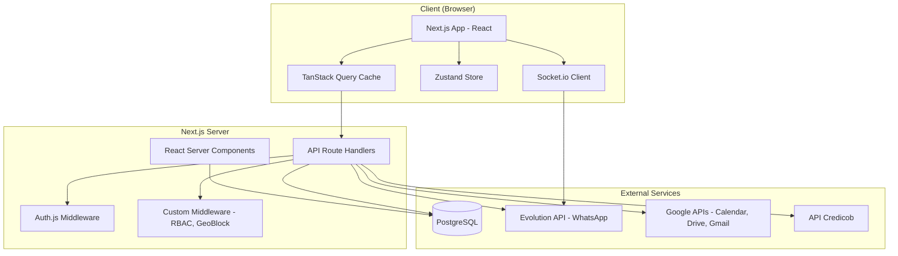
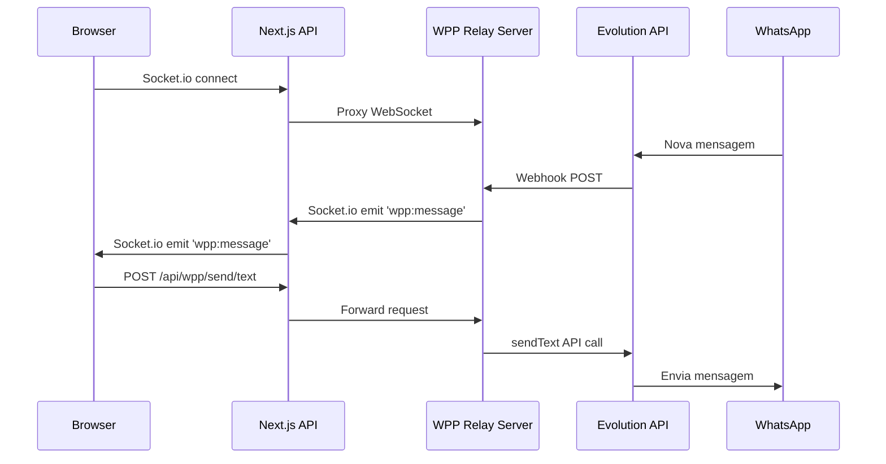

# Design Document: Maestro 360 Rewrite

## Overview

Este documento descreve a arquitetura técnica para a reescrita completa do CRM Maestro 360 (Gênesis) — de uma aplicação vanilla HTML/CSS/JS com persistência em localStorage para uma stack moderna baseada em Next.js 14+ (App Router), TanStack Query, Auth.js e PostgreSQL.

A reescrita preserva todas as regras de negócio existentes dos 24+ módulos, habilita colaboração multi-usuário com controle de acesso baseado em papéis, e mantém integrações em tempo real (WhatsApp via Evolution API, Google Calendar/Drive/Gmail, API Credicob).

### Decisões Arquiteturais Chave

| Decisão | Escolha | Justificativa |
|---------|---------|---------------|
| Framework | Next.js 14+ App Router | RSC para SEO e performance, API Routes integradas, eliminando necessidade de servidor Express separado |
| ORM | Drizzle ORM | Type-safe, SQL-first, melhor performance que Prisma para schemas existentes, suporte nativo a PostgreSQL |
| Autenticação | Auth.js v5 (NextAuth) | Providers de credenciais + Google OAuth, sessões JWT, middleware nativo Next.js |
| Estado do Servidor | TanStack Query v5 | Cache, invalidação, mutações otimistas, retry automático |
| Estado do Cliente | Zustand | Leve, sem boilerplate, para UI state (sidebar, modais, preferências) |
| UI Components | Tailwind CSS + shadcn/ui | Componentes acessíveis, customizáveis, sem lock-in de biblioteca |
| Real-time | Socket.io Client | Compatível com servidor Evolution API existente |
| Validação | Zod | Schema validation compartilhada entre client e server |
| Formulários | React Hook Form + Zod resolver | Performance, validação integrada |

## Architecture

### Diagrama de Alto Nível



### Estratégia RSC vs Client Components

| Tipo | Uso | Exemplos |
|------|-----|----------|
| Server Component (RSC) | Busca inicial de dados, layouts, páginas estáticas | Dashboard shell, lista de leads (SSR), perfil de lead |
| Client Component | Interações, estado local, event handlers, real-time | Kanban drag-and-drop, chat WhatsApp, formulários, modais |

**Regra geral**: Páginas iniciam como RSC e delegam interatividade para client components via `"use client"`.

### Arquitetura do WhatsApp Real-Time



**Decisão**: O servidor WhatsApp (Express + Socket.io) permanece como serviço separado. O Next.js atua como proxy para as rotas WhatsApp e repassa eventos Socket.io ao browser. Isso mantém a separação de responsabilidades e permite escalar o serviço WhatsApp independentemente.

## Components and Interfaces

### Estrutura de Diretórios

```
maestro360-next/
├── src/
│   ├── app/                          # Next.js App Router
│   │   ├── (auth)/                   # Grupo de rotas autenticadas
│   │   │   ├── layout.tsx            # Shell com sidebar + header
│   │   │   ├── dashboard/page.tsx
│   │   │   ├── leads/
│   │   │   │   ├── page.tsx          # Lista de leads
│   │   │   │   └── [id]/page.tsx     # Perfil do lead
│   │   │   ├── funil/page.tsx        # Kanban
│   │   │   ├── simulador/page.tsx    # Wizard 6 etapas
│   │   │   ├── comparativo/page.tsx
│   │   │   ├── historico/page.tsx
│   │   │   ├── agenda/page.tsx
│   │   │   ├── metas/page.tsx
│   │   │   ├── chat/page.tsx         # WhatsApp
│   │   │   ├── email/page.tsx
│   │   │   ├── cotas/page.tsx
│   │   │   ├── cotas-disponiveis/page.tsx
│   │   │   ├── propostas/page.tsx
│   │   │   ├── contratos/page.tsx
│   │   │   ├── parcelas/page.tsx
│   │   │   ├── assembleias/page.tsx
│   │   │   ├── contemplados/page.tsx
│   │   │   ├── campanhas/page.tsx
│   │   │   ├── equipe/page.tsx
│   │   │   ├── configuracoes/page.tsx
│   │   │   ├── logs/page.tsx
│   │   │   └── notificacoes/page.tsx
│   │   ├── (public)/                 # Rotas públicas
│   │   │   └── login/page.tsx
│   │   ├── api/                      # API Route Handlers
│   │   │   ├── auth/[...nextauth]/route.ts
│   │   │   ├── leads/route.ts
│   │   │   ├── leads/[id]/route.ts
│   │   │   ├── funil/route.ts
│   │   │   ├── simulacoes/route.ts
│   │   │   ├── propostas/route.ts
│   │   │   ├── contratos/route.ts
│   │   │   ├── reunioes/route.ts
│   │   │   ├── cotas/route.ts
│   │   │   ├── metas/route.ts
│   │   │   ├── notificacoes/route.ts
│   │   │   ├── configuracoes/route.ts
│   │   │   ├── equipe/route.ts
│   │   │   ├── campanhas/route.ts
│   │   │   ├── audit/route.ts
│   │   │   ├── busca/route.ts
│   │   │   ├── wpp/[...path]/route.ts   # Proxy para WPP server
│   │   │   ├── google/route.ts
│   │   │   └── credicob/route.ts
│   │   ├── layout.tsx                # Root layout
│   │   └── globals.css
│   ├── components/
│   │   ├── ui/                       # shadcn/ui components
│   │   ├── layout/
│   │   │   ├── sidebar.tsx
│   │   │   ├── header.tsx
│   │   │   ├── mobile-nav.tsx
│   │   │   └── breadcrumb.tsx
│   │   ├── leads/
│   │   ├── funil/
│   │   ├── simulador/
│   │   ├── chat/
│   │   ├── agenda/
│   │   ├── dashboard/
│   │   └── shared/
│   │       ├── data-table.tsx
│   │       ├── empty-state.tsx
│   │       ├── kpi-card.tsx
│   │       └── search-global.tsx
│   ├── lib/
│   │   ├── db/
│   │   │   ├── index.ts              # Drizzle client singleton
│   │   │   ├── schema.ts             # Drizzle schema (gerado do SQL)
│   │   │   └── migrations/
│   │   ├── auth/
│   │   │   ├── config.ts             # Auth.js configuration
│   │   │   ├── geo-block.ts          # Geo-blocking logic
│   │   │   └── rbac.ts               # Role-based access control
│   │   ├── validators/               # Zod schemas
│   │   │   ├── lead.ts
│   │   │   ├── simulacao.ts
│   │   │   ├── proposta.ts
│   │   │   ├── reuniao.ts
│   │   │   └── auth.ts
│   │   ├── utils/
│   │   │   ├── format.ts             # Formatação R$, datas, telefone
│   │   │   ├── sequential-code.ts    # Geração CLI-XXXX, COT-XXXX, CTR-XXXX
│   │   │   └── calculations.ts       # Cálculos comparativo/simulador
│   │   └── api/
│   │       ├── client.ts             # Fetch wrapper com auth
│   │       └── error.ts              # Error handling padronizado
│   ├── hooks/
│   │   ├── use-leads.ts              # TanStack Query hooks para leads
│   │   ├── use-funil.ts
│   │   ├── use-simulacoes.ts
│   │   ├── use-reunioes.ts
│   │   ├── use-chat.ts
│   │   ├── use-notificacoes.ts
│   │   └── use-socket.ts            # Socket.io connection hook
│   ├── stores/
│   │   ├── sidebar-store.ts          # Estado da sidebar
│   │   ├── chat-store.ts             # Chat UI state
│   │   └── ui-store.ts               # Modais, toasts, preferências
│   └── types/
│       ├── lead.ts
│       ├── funil.ts
│       ├── simulacao.ts
│       ├── auth.ts
│       └── index.ts
├── drizzle.config.ts
├── next.config.ts
├── tailwind.config.ts
├── package.json
└── tsconfig.json
```

### Interfaces Principais

#### Auth.js Configuration

```typescript
// src/lib/auth/config.ts
import NextAuth from "next-auth";
import Credentials from "next-auth/providers/credentials";
import Google from "next-auth/providers/google";
import { db } from "@/lib/db";
import bcrypt from "bcryptjs";

export const { handlers, auth, signIn, signOut } = NextAuth({
  providers: [
    Credentials({
      credentials: {
        email: { type: "email" },
        senha: { type: "password" },
        lat: { type: "text" },
        lon: { type: "text" },
      },
      async authorize(credentials) {
        // 1. Geo-block validation
        // 2. Rate limiting (5 tentativas / 15 min)
        // 3. Busca usuário + bcrypt compare
        // 4. Audit log
        // Retorna user object ou null
      },
    }),
    Google({
      clientId: process.env.GOOGLE_CLIENT_ID,
      clientSecret: process.env.GOOGLE_CLIENT_SECRET,
      authorization: {
        params: {
          scope: "openid email profile https://www.googleapis.com/auth/calendar https://www.googleapis.com/auth/drive.file https://www.googleapis.com/auth/gmail.modify https://www.googleapis.com/auth/gmail.send",
          access_type: "offline",
          prompt: "consent",
        },
      },
    }),
  ],
  session: {
    strategy: "jwt",
    maxAge: 8 * 60 * 60, // 8 horas
  },
  callbacks: {
    jwt({ token, user }) { /* Inclui papel, id no token */ },
    session({ session, token }) { /* Expõe papel, id na session */ },
  },
});
```

#### RBAC Middleware

```typescript
// src/lib/auth/rbac.ts
export type Role = "admin" | "gerente" | "vendedor";

export interface Permission {
  module: string;
  actions: ("read" | "create" | "update" | "delete")[];
  ownerOnly?: boolean; // vendedor só acessa próprios dados
}

const ROLE_PERMISSIONS: Record<Role, Permission[]> = {
  admin: [{ module: "*", actions: ["read", "create", "update", "delete"] }],
  gerente: [
    { module: "leads", actions: ["read", "create", "update", "delete"] },
    { module: "simulacoes", actions: ["read", "create", "update", "delete"] },
    { module: "propostas", actions: ["read", "create", "update", "delete"] },
    { module: "contratos", actions: ["read", "create", "update", "delete"] },
    { module: "reunioes", actions: ["read", "create", "update", "delete"] },
    { module: "funil", actions: ["read", "create", "update", "delete"] },
    { module: "metas", actions: ["read", "update"] },
    { module: "cotas", actions: ["read", "create", "update", "delete"] },
    { module: "campanhas", actions: ["read", "create", "update", "delete"] },
    { module: "configuracoes", actions: ["read"] },
    { module: "dashboard", actions: ["read"] },
  ],
  vendedor: [
    { module: "leads", actions: ["read", "create", "update", "delete"], ownerOnly: true },
    { module: "simulacoes", actions: ["read", "create"], ownerOnly: true },
    { module: "propostas", actions: ["read", "create", "update"], ownerOnly: true },
    { module: "contratos", actions: ["read"], ownerOnly: true },
    { module: "reunioes", actions: ["read", "create", "update"], ownerOnly: true },
    { module: "funil", actions: ["read"] },
    { module: "metas", actions: ["read"], ownerOnly: true },
    { module: "dashboard", actions: ["read"] },
  ],
};

export function checkPermission(
  role: Role,
  module: string,
  action: string,
  resourceOwnerId?: number,
  userId?: number
): boolean {
  const perms = ROLE_PERMISSIONS[role];
  const perm = perms.find(p => p.module === "*" || p.module === module);
  if (!perm) return false;
  if (!perm.actions.includes(action as any)) return false;
  if (perm.ownerOnly && resourceOwnerId !== undefined && resourceOwnerId !== userId) {
    return false;
  }
  return true;
}
```

#### TanStack Query Hook Pattern

```typescript
// src/hooks/use-leads.ts
import { useQuery, useMutation, useQueryClient } from "@tanstack/react-query";
import { api } from "@/lib/api/client";
import type { Lead, CreateLeadInput } from "@/types/lead";

export const leadKeys = {
  all: ["leads"] as const,
  lists: () => [...leadKeys.all, "list"] as const,
  list: (filters: Record<string, unknown>) => [...leadKeys.lists(), filters] as const,
  details: () => [...leadKeys.all, "detail"] as const,
  detail: (id: number) => [...leadKeys.details(), id] as const,
};

export function useLeads(filters: LeadFilters) {
  return useQuery({
    queryKey: leadKeys.list(filters),
    queryFn: () => api.get<PaginatedResponse<Lead>>("/api/leads", { params: filters }),
    staleTime: 30_000, // 30s
  });
}

export function useCreateLead() {
  const queryClient = useQueryClient();
  return useMutation({
    mutationFn: (data: CreateLeadInput) => api.post<Lead>("/api/leads", data),
    onMutate: async (newLead) => {
      // Optimistic update
      await queryClient.cancelQueries({ queryKey: leadKeys.lists() });
      const previous = queryClient.getQueryData(leadKeys.lists());
      // Add optimistic lead to cache
      return { previous };
    },
    onError: (_err, _vars, context) => {
      // Rollback
      if (context?.previous) {
        queryClient.setQueryData(leadKeys.lists(), context.previous);
      }
    },
    onSettled: () => {
      queryClient.invalidateQueries({ queryKey: leadKeys.lists() });
    },
  });
}
```

#### Geo-Block Service

```typescript
// src/lib/auth/geo-block.ts
import { z } from "zod";

const RMBH_BOUNDS = {
  latMin: -20.50, latMax: -19.50,
  lonMin: -44.45, lonMax: -43.55,
};

const RMBH_CITIES = new Set([
  "belo horizonte", "contagem", "betim", "sabará", "santa luzia",
  "nova lima", "ibirité", "vespasiano", "ribeirão das neves",
  "esmeraldas", "lagoa santa", "pedro leopoldo", "brumadinho",
  // ... demais cidades da RMBH
]);

export interface GeoValidationResult {
  allowed: boolean;
  method: "gps" | "ip" | "blocked";
  geoInfo: GeoInfo;
}

export async function validateGeoLocation(
  lat: number | null,
  lon: number | null,
  ip: string
): Promise<GeoValidationResult> {
  // 1. Se GPS disponível, valida coordenadas no bounding box
  if (lat !== null && lon !== null) {
    const inBounds = lat >= RMBH_BOUNDS.latMin && lat <= RMBH_BOUNDS.latMax &&
                     lon >= RMBH_BOUNDS.lonMin && lon <= RMBH_BOUNDS.lonMax;
    return { allowed: inBounds, method: "gps", geoInfo: /* ... */ };
  }
  // 2. Fallback: geolocalização por IP
  const ipGeo = await fetchIPGeolocation(ip);
  if (!ipGeo) return { allowed: false, method: "blocked", geoInfo: /* ... */ };
  const cityNormalized = normalizeCity(ipGeo.city);
  return { allowed: RMBH_CITIES.has(cityNormalized), method: "ip", geoInfo: /* ... */ };
}

export function isInRMBH(lat: number, lon: number): boolean {
  return lat >= RMBH_BOUNDS.latMin && lat <= RMBH_BOUNDS.latMax &&
         lon >= RMBH_BOUNDS.lonMin && lon <= RMBH_BOUNDS.lonMax;
}
```

#### Sequential Code Generator

```typescript
// src/lib/utils/sequential-code.ts
import { db } from "@/lib/db";
import { sql } from "drizzle-orm";

export type CodePrefix = "CLI" | "COT" | "CTR" | "PROP";

/**
 * Gera código sequencial usando PostgreSQL sequences.
 * Garante unicidade em ambiente concorrente.
 */
export async function generateSequentialCode(prefix: CodePrefix): Promise<string> {
  const sequenceName = `seq_${prefix.toLowerCase()}`;
  const result = await db.execute(
    sql`SELECT nextval(${sql.raw(`'${sequenceName}'`)}) as val`
  );
  const num = Number(result.rows[0].val);
  return `${prefix}-${String(num).padStart(4, "0")}`;
}
```

#### Comparative Calculator

```typescript
// src/lib/utils/calculations.ts

export interface ConsorcioParams {
  valorBem: number;
  entrada: number;        // percentual 0-50
  parcelaMensal: number;
  prazoMeses: number;
  iptuMensal: number;
  condominioMensal: number;
  manutencaoMensal: number;
  valorizacaoAnual: number; // percentual 0-20
}

export interface AluguelParams {
  aluguelMensal: number;
  reajusteAnual: number;    // percentual 0-30
  taxaRendimento: number;   // percentual a.a. 0-30
}

export interface ComparativoResult {
  custoConsorcio: number[];    // acumulado por ano
  custoAluguel: number[];      // acumulado por ano
  custoFinanciamento: number[]; // acumulado por ano
  economiaAbsoluta: number;
  economiaPercentual: number;
  recomendacao: string;
}

export function calcularComparativo(
  consorcio: ConsorcioParams,
  aluguel: AluguelParams,
  financiamento: FinanciamentoParams,
  horizonteAnos: number
): ComparativoResult {
  // Cálculos de custo acumulado para cada cenário
  // Retorna arrays anuais + métricas de comparação
}
```

## Data Models

### Drizzle Schema (mapeamento do schema.sql existente)

O schema Drizzle será gerado a partir do schema PostgreSQL existente usando `drizzle-kit introspect`. As tabelas principais:

```typescript
// src/lib/db/schema.ts (gerado + ajustado)
import { pgTable, serial, varchar, text, boolean, timestamp, 
         numeric, integer, smallint, jsonb, inet, bigserial,
         date, time, char, uniqueIndex, index } from "drizzle-orm/pg-core";
import { relations } from "drizzle-orm";

export const usuarios = pgTable("usuarios", {
  id: serial("id").primaryKey(),
  nome: varchar("nome", { length: 120 }).notNull(),
  email: varchar("email", { length: 200 }).notNull().unique(),
  senhaHash: text("senha_hash"),
  papel: varchar("papel", { length: 30 }).notNull().default("vendedor"),
  ativo: boolean("ativo").notNull().default(true),
  criadoEm: timestamp("criado_em", { withTimezone: true }).notNull().defaultNow(),
  atualizadoEm: timestamp("atualizado_em", { withTimezone: true }).notNull().defaultNow(),
});

export const leads = pgTable("leads", {
  id: serial("id").primaryKey(),
  nome: varchar("nome", { length: 200 }).notNull(),
  telefone: varchar("telefone", { length: 40 }),
  email: varchar("email", { length: 200 }),
  origem: varchar("origem", { length: 40 }),
  objetivo: varchar("objetivo", { length: 80 }),
  valorDesejado: numeric("valor_desejado", { precision: 14, scale: 2 }),
  aporteMensal: numeric("aporte_mensal", { precision: 14, scale: 2 }),
  obs: text("obs"),
  stageId: varchar("stage_id", { length: 80 }).references(() => funilEstagios.id),
  funilId: varchar("funil_id", { length: 60 }).references(() => funis.id),
  responsavelId: integer("responsavel_id").references(() => usuarios.id),
  criadoEm: timestamp("criado_em", { withTimezone: true }).notNull().defaultNow(),
  atualizadoEm: timestamp("atualizado_em", { withTimezone: true }).notNull().defaultNow(),
});

export const funis = pgTable("funis", {
  id: varchar("id", { length: 60 }).primaryKey(),
  label: varchar("label", { length: 80 }).notNull(),
  cor: varchar("cor", { length: 7 }).notNull().default("#1a3a5c"),
  padrao: boolean("padrao").notNull().default(false),
  criadoEm: timestamp("criado_em", { withTimezone: true }).notNull().defaultNow(),
});

export const funilEstagios = pgTable("funil_estagios", {
  id: varchar("id", { length: 80 }).primaryKey(),
  funilId: varchar("funil_id", { length: 60 }).notNull().references(() => funis.id),
  label: varchar("label", { length: 80 }).notNull(),
  cor: varchar("cor", { length: 7 }).notNull().default("#6b7280"),
  ordem: smallint("ordem").notNull().default(0),
  criadoEm: timestamp("criado_em", { withTimezone: true }).notNull().defaultNow(),
});

// ... demais tabelas seguem o mesmo padrão do schema.sql
```

### Relações Drizzle

```typescript
export const leadsRelations = relations(leads, ({ one, many }) => ({
  responsavel: one(usuarios, { fields: [leads.responsavelId], references: [usuarios.id] }),
  funil: one(funis, { fields: [leads.funilId], references: [funis.id] }),
  estagio: one(funilEstagios, { fields: [leads.stageId], references: [funilEstagios.id] }),
  tags: many(leadTags),
  notas: many(leadNotas),
  historico: many(leadHistorico),
  simulacoes: many(simulacoes),
  reunioes: many(reunioes),
  propostas: many(propostas),
  contratos: many(contratos),
  wppLinks: many(wppLinks),
}));
```

### Zod Validation Schemas

```typescript
// src/lib/validators/lead.ts
import { z } from "zod";

export const createLeadSchema = z.object({
  nome: z.string().min(3).max(200),
  telefone: z.string().regex(/^\(\d{2}\)\s?\d{4,5}-\d{4}$/),
  email: z.string().email().optional().or(z.literal("")),
  valorDesejado: z.number().min(0).optional(),
  objetivo: z.enum(["Comprar Imóvel", "Comprar Carro", "Ganho Financeiro", "Capital de Giro", "Outro"]).optional(),
  origem: z.enum(["WhatsApp", "Instagram", "Indicação", "Site", "Ligação", "Outro"]).optional(),
  stageId: z.string().optional(),
  funilId: z.string().optional(),
});

// src/lib/validators/simulacao.ts
export const simulacaoStep1Schema = z.object({
  nome: z.string().min(3).max(120),
  telefone: z.string().regex(/^\d{11}$/),
  cpf: z.string().optional().refine(val => !val || validarCPF(val), "CPF inválido"),
  email: z.string().email().optional().or(z.literal("")),
});

export const simulacaoStep3Schema = z.object({
  creditoDesejado: z.number().min(50_000).max(2_000_000),
  aporteMensal: z.number().positive(),
  lanceDisponivel: z.number().min(0).optional(),
});
```


## Correctness Properties

*A property is a characteristic or behavior that should hold true across all valid executions of a system — essentially, a formal statement about what the system should do. Properties serve as the bridge between human-readable specifications and machine-verifiable correctness guarantees.*

### Property 1: Geo-validation correctness

*For any* pair of GPS coordinates (lat, lon), the function `isInRMBH(lat, lon)` SHALL return `true` if and only if `lat` is within [-20.50, -19.50] AND `lon` is within [-44.45, -43.55].

**Validates: Requirements 2.4, 2.6**

### Property 2: Authentication error message uniformity

*For any* invalid login attempt (email not found, account inactive, or wrong password), the system SHALL return the same generic error message and HTTP status code, making it impossible to distinguish which credential field is incorrect from the response alone.

**Validates: Requirements 2.2**

### Property 3: Audit log completeness

*For any* login attempt (successful or failed), the system SHALL persist a record in `auth_audit_logs` containing all required fields: username_digitado, ip, user_agent, os, navegador, status, and timestamp_utc — none of which SHALL be null.

**Validates: Requirements 2.9**

### Property 4: RBAC permission enforcement

*For any* combination of user role (admin | gerente | vendedor), module name, action (read | create | update | delete), and resource owner ID, the function `checkPermission` SHALL return `true` only when the role's permission set includes that module+action AND (if ownerOnly is set) the resource owner matches the requesting user's ID.

**Validates: Requirements 3.2, 3.3, 3.4, 3.5**

### Property 5: Sequential code uniqueness and format

*For any* sequence of N code generations with prefix P ∈ {CLI, COT, CTR, PROP}, all generated codes SHALL be unique, match the format `P-XXXX` (where XXXX is zero-padded), and the numeric portion SHALL be strictly monotonically increasing.

**Validates: Requirements 27.1, 27.2, 27.3, 27.4, 4.8, 6.9**

### Property 6: Kanban stage ordering

*For any* set of stages belonging to a funnel, the Kanban columns SHALL be rendered in ascending order of the `ordem` field, such that for any two adjacent columns, the left column's `ordem` is strictly less than the right column's `ordem`.

**Validates: Requirements 4.1**

### Property 7: Stage regression detection

*For any* lead move from stage A to stage B within the same funnel, the system SHALL flag the move as a regression (requiring confirmation) if and only if stage B's `ordem` value is strictly less than stage A's `ordem` value.

**Validates: Requirements 4.5**

### Property 8: Lead creation validation

*For any* lead creation input, the system SHALL accept the input if and only if: nome has 3-200 characters, telefone matches Brazilian phone mask pattern, email (if provided) is valid format, and valor (if provided) is non-negative.

**Validates: Requirements 4.7, 5.6**

### Property 9: Pagination invariant

*For any* dataset of size N and page number P (1-indexed) with page size 20, the returned page SHALL contain exactly `min(20, max(0, N - (P-1)*20))` items, and the union of all pages SHALL equal the complete dataset.

**Validates: Requirements 5.1**

### Property 10: Tag validation constraints

*For any* tag addition attempt on a lead, the system SHALL reject the operation if the tag label length is outside [1, 30] characters, OR the lead already has 10 tags, OR the color is not a valid 7-character hex string (e.g., #RRGGBB).

**Validates: Requirements 5.6, 5.9**

### Property 11: CPF validation algorithm

*For any* 11-digit string, the CPF validator SHALL return `true` if and only if the two check digits match the algorithm defined by the Receita Federal (weighted sum modulo 11 for each check digit), AND the string is not composed of all identical digits.

**Validates: Requirements 6.3**

### Property 12: Comparative calculation monotonicity

*For any* valid set of comparative parameters (consórcio, aluguel, financiamento) and horizon H years, the cumulative cost arrays SHALL be monotonically non-decreasing (each year's accumulated cost ≥ previous year's), and the final values SHALL equal the sum of all periodic costs over H years.

**Validates: Requirements 7.3**

### Property 13: Recommendation matches minimum cost

*For any* comparative calculation result with three scenarios, the textual recommendation SHALL identify the scenario with the lowest total cost at the configured horizon, and the `economiaAbsoluta` SHALL equal the difference between the second-lowest and lowest total costs.

**Validates: Requirements 7.4**

### Property 14: Optimistic update rollback on failure

*For any* mutation that fails on the server, the TanStack Query cache SHALL be restored to its exact pre-mutation state, such that the UI displays the same data as before the mutation was attempted.

**Validates: Requirements 28.2**

### Property 15: Global search result cap

*For any* search query returning results, each entity type group (leads, propostas, contratos) SHALL contain at most 10 items, regardless of the total number of matching entities in the database.

**Validates: Requirements 26.5**

## Error Handling

### Estratégia de Erros por Camada

| Camada | Estratégia | Implementação |
|--------|-----------|---------------|
| API Route Handlers | Try-catch com resposta padronizada | `ApiError` class com status code e mensagem segura |
| Database | Connection pool com timeout de 5s | Drizzle + pg pool config, retry com backoff |
| Auth | Mensagens genéricas, nunca expor detalhes | Mesmo erro para email/senha incorretos |
| External APIs | Timeout + fallback + retry | Axios interceptors, TanStack Query retry |
| Client | Toast notifications + rollback otimista | Sonner toast + onError callbacks |
| Socket.io | Reconexão automática a cada 15s | Socket.io reconnection config |

### Error Response Format

```typescript
// Resposta de erro padronizada (nunca expõe stack traces ou detalhes internos)
interface ApiErrorResponse {
  error: {
    code: string;        // 'VALIDATION_ERROR' | 'NOT_FOUND' | 'FORBIDDEN' | 'INTERNAL'
    message: string;     // Mensagem amigável em português
    details?: Record<string, string[]>; // Erros de validação por campo (apenas para 422)
  };
}
```

### Cenários de Erro Específicos

1. **Conexão PostgreSQL falha**: Retorna 503 com mensagem "Serviço temporariamente indisponível" em ≤ 5s
2. **Token JWT expirado**: Retorna 401, client intercepta e redireciona para login
3. **Geo-block**: Retorna 403 com código `GEO_BLOCKED` e mensagem sobre restrição geográfica
4. **Rate limit (5 tentativas)**: Retorna 429 com `Retry-After` header de 900s (15 min)
5. **Evolution API indisponível**: Exibe banner "WhatsApp desconectado" + botão reconectar
6. **API Credicob timeout**: Exibe mensagem de indisponibilidade + botão retry manual
7. **Google OAuth revogado**: Exibe mensagem orientando reconexão da conta Google
8. **Drag-and-drop falha**: Reverte card para coluna original + toast de erro
9. **Upload > 16MB**: Rejeita no client antes do upload com mensagem de limite

### Logging

- **Server-side**: Structured logging com `pino` (JSON) para erros, warnings e audit events
- **Client-side**: Erros capturados pelo Error Boundary do Next.js + reportados via `console.error`
- **Audit**: Todas as tentativas de login registradas em `auth_audit_logs` (fire-and-forget)

## Testing Strategy

### Abordagem Dual: Unit Tests + Property-Based Tests

| Tipo | Framework | Foco |
|------|-----------|------|
| Unit Tests | Vitest | Exemplos específicos, edge cases, integração entre componentes |
| Property Tests | Vitest + fast-check | Propriedades universais, cobertura ampla de inputs |
| Component Tests | Vitest + Testing Library | Renderização de componentes, interações de UI |
| E2E Tests | Playwright | Fluxos críticos end-to-end (login, criar lead, simulação) |
| Integration Tests | Vitest + testcontainers | API routes com banco real (PostgreSQL em container) |

### Property-Based Testing (fast-check)

**Biblioteca**: `fast-check` (JavaScript/TypeScript)
**Configuração**: Mínimo 100 iterações por propriedade

Cada property test referencia a propriedade do design document:

```typescript
// Exemplo: Property 1 - Geo-validation
// Feature: maestro360-rewrite, Property 1: Geo-validation correctness
test.prop("isInRMBH returns true iff coordinates within RMBH bounds", [
  fc.double({ min: -90, max: 90 }),   // lat
  fc.double({ min: -180, max: 180 }), // lon
], (lat, lon) => {
  const result = isInRMBH(lat, lon);
  const expected = lat >= -20.50 && lat <= -19.50 && lon >= -44.45 && lon <= -43.55;
  expect(result).toBe(expected);
}, { numRuns: 200 });
```

### Propriedades a Implementar como PBT

| # | Propriedade | Módulo Testado |
|---|-------------|----------------|
| 1 | Geo-validation | `lib/auth/geo-block.ts` |
| 2 | Error message uniformity | `api/auth/login` |
| 3 | Audit log completeness | `api/auth/login` |
| 4 | RBAC permission check | `lib/auth/rbac.ts` |
| 5 | Sequential code uniqueness | `lib/utils/sequential-code.ts` |
| 6 | Kanban stage ordering | `components/funil/kanban.tsx` |
| 7 | Stage regression detection | `lib/utils/stage-helpers.ts` |
| 8 | Lead creation validation | `lib/validators/lead.ts` |
| 9 | Pagination invariant | `lib/utils/pagination.ts` |
| 10 | Tag validation | `lib/validators/lead.ts` |
| 11 | CPF validation | `lib/validators/cpf.ts` |
| 12 | Comparative calculation monotonicity | `lib/utils/calculations.ts` |
| 13 | Recommendation matches minimum | `lib/utils/calculations.ts` |
| 14 | Optimistic rollback | `hooks/use-*.ts` (com mocks) |
| 15 | Search result cap | `api/busca/route.ts` |

### Unit Tests (Exemplos e Edge Cases)

- Login com GPS negado + IP na RMBH → permite (fallback)
- Login com GPS negado + IP fora da RMBH → bloqueia
- Login com serviço IP indisponível + GPS indisponível → bloqueia
- Wizard simulador: avançar sem preencher etapa → bloqueado
- Drag-and-drop com API failure → card reverte
- Reunião com Google Calendar desconectado → salva localmente
- Mensagem WhatsApp de número desconhecido → cria lead automaticamente
- Parcela com vencimento passado → status atualiza para 'atrasado'
- Busca global com < 2 caracteres → não dispara
- Sidebar em viewport < 768px → colapsa para ícones

### E2E Tests (Playwright)

Fluxos críticos:
1. Login completo (credenciais + geo-block + sessão)
2. Criar lead → mover no Kanban → criar simulação → gerar proposta → converter em contrato
3. Chat WhatsApp: enviar mensagem de texto + receber mensagem
4. Wizard simulador: completar 6 etapas → gerar COT-XXXX
5. Dashboard: verificar KPIs carregam com dados reais

### Cobertura Mínima

- **Unit + Property**: ≥ 80% de cobertura em `lib/` e `hooks/`
- **Component**: Todos os formulários e componentes interativos
- **E2E**: 5 fluxos críticos acima
- **Integration**: Todas as API routes com banco real
